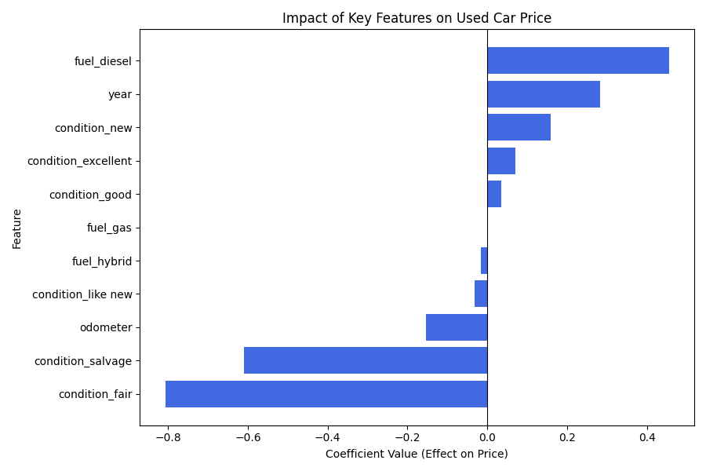

# Module 11 Practical Application Assignment - What drives the price of a car?

## Overview

The goal of this project is to build regression models that predict the log-transformed price of used vehicles based on their characteristics (year, make, mileage, etc.) and to analyze/ identify the factors that influence a car price.
Dataset
* Source: Craigslist vehicle listings dataset
* Size: 42,000+ rows before cleaning, ~31,000 after cleaning
* Target Variable: price_log — the natural log of the vehicle's listed price

## Notebooks
- coupon_analysis.ipynb: [link to colab notebook code]([https://drive.google.com/file/d/1FaYJIwel29aY514VXwAM2iGC_nz1itWV/view?usp=sharing](https://drive.google.com/file/d/1j8aCwJ5I4aJp9V_eHGrjQLHVO2qX6LuH/view?usp=sharing))

## Data Description 
- id – Unique listing ID
- price – Listing price of the vehicle (target variable)
- year – Manufacturing year of the vehicle
- manufacturer – Manufacturer/brand of the vehicle (e.g., Ford, Toyota)
- model – Specific model of the vehicle (e.g., Camry, Civic)
- condition – Condition of the vehicle (e.g., new, like new, excellent, good, fair, salvage)
- cylinders – Number of engine cylinders (e.g., 4 cylinders, 6 cylinders)
- fuel – Type of fuel used (e.g., gas, diesel, electric, hybrid)
- odometer – Mileage of the vehicle (in miles)
- title_status – Legal ownership status (e.g., clean, rebuilt, salvage)
- transmission – Transmission type (e.g., automatic, manual)
- VIN – Vehicle Identification Number
- drive – Drive type (e.g., 4wd, fwd, rwd)
- size – Size category of the vehicle (e.g., compact, full-size)
- type – Vehicle body type (e.g., SUV, truck, sedan)
- paint_color – Exterior color
- state – U.S. state where the vehicle is listed

## Data Cleaning/Preprocessing
### Data Cleaning 
- Added a new column called area to catagorize the states based on direction (east,  west, central)
- Filtered out outliers based on price, odometer, and year using IQR
- *Drop 4 Columns due to missing values/High-cardinality**:
  * `region` , `VIN` both had High-cardinalityand were dropped
  * `model` and `id` had too many unique values.
  

### Feature Engineering
- Created new feature: age = 2025 - year
   - Features that ended up beign used Used: year, odometer, manufacturer, condition, cylinders, fuel, title_status, transmission, drive, type, paint_color, state, area, "age"
- Applied log transformation to price to handle skewness
-  
 - - Log-Transformed Price (log(1 + price)) is clearly better for modeling.
     - Removes extreme skew and compresses high-end outliers
     - Makes the relationship between predictors and target more linear
     - Improves performance and interpretability of models like Linear, Ridge, Lasso
- Handled categorical variables using one-hot encoding
  
### EDA and Correlation Analysis
  - Perform univariate and bivariate analysis to:
  - Understand distributions (histograms)
  -  Identify correlations with target (`price`) and (`price_log`)using heatmaps \
    
  - Adding price_log to the correlation map, gives a higher correlation to yr than the regular "price. Decided to use the "price log" as a target:
    
- Scaled numerical features using standardization
- Added polynomial features (degree=2) to capture interaction and non-linear effects among numeric predictors

---
### Price Vs Categorical Features

**Price Vs. Type**

- 	Trucks, vans, convertibles show high median prices. Sedans and hatchbacks are lower.

**Price Vs.Transmission**

- 	Automatics are more expensive, followed by manuals. "Other" has wide variability.
  
**Price Vs. Title Status**

* Clean titles are most valuable. Salvage/lien/rebuilt show major price drops.
  
**Price Vs. State**

- Geographic influence is visible. CA, TX, NY tend to have higher prices and greater spread

**Price Vs. Paint Color**

-  Little impact overall. Neutral tones (white, black, silver) dominate listings.
  
**Price Vs. Model**

* Too many categories — high-cardinality. Difficult to visualize; needs dimensionality reduction.
  
**Price Vs. Manufacturer**

* Luxury brands (BMW, Mercedes, Lexus) fetch higher prices; mainstream brands vary widely.
  
**Price Vs. Fuel**

* Diesel vehicles are most expensive. Hybrid cars show lower prices.
  
  **Price Vs. Drive**

* 4WD vehicles (e.g., trucks/SUVs) are most expensive. FWD cheapest.

**Price Vs. Cylinders**

* More cylinders = higher prices. 8- and 10-cylinder vehicles lead; 4-cylinder most common.

**Price Vs. Condition**

* Clear progression: New > Like New > Excellent > Good > Fair > Salvage in pricing tiers.

**Price Vs. Area/Region**

* East/Central regions show higher and broader price distributions than the West.

---
### Price Vs Numerical Features

**Price Vs. Odometer**

- 	Negative correlation with price — higher mileage lowers value. Outliers exist.

**Price Vs. Year**

-  Newer cars are clearly more expensive. Strong upward trend from 2000 to 2021.
  
**Price Distrubution**

- Highly right-skewed; many vehicles priced under $30K, few high-end outliers.
---

## Model Performance Summary (with Cross-Validation):
- Each model was evaluated using a combination of 5-fold cross-validation on the training set and hold-out testing on unseen data. Here's what the performance metrics reveal:

### Key Observations:

- All three models exhibit similar performance, with Ridge Regression achieving the best test R² (0.8415) and lowest RMSE.
- Linear Regression performs nearly as well, while Lasso shows slightly higher error but enables feature selection.
- These results were derived using 5-fold cross-validation and a 20% hold-out test set.
- The accompanying bar plot visualizes the cross-validated R² scores with error bars (standard deviation), highlighting the consistency of model performance across folds.

### Visual Interpretation:
 
The bar plot comparing models with error bars helps visualize model stability: Ridge and Linear Regression show nearly identical mean R² values, with Ridge having slightly narrower error margins.
- This suggests Ridge may generalize slightly better across unseen data. Lasso, while slightly lower in R², is valuable when simpler models or feature selection is desired. These visual insights complement the numerical results and guide the choice of model depending on the application’s priority: accuracy vs. interpretability.

## Key Features Impacting Used Car Price

Based on the coefficient analysis from the best-performing model (Ridge or Lasso), the following features had the strongest impact on price predictions:

### Top Predictive Features effect on price: 
- year / age: Newer vehicles tend to be priced higher.
- fuel_diesel: Diesel-powered vehicles have higher resale value.
- condition_excellent/ new: Excellent condition significantly boosts price.
- odometer: Higher mileage lowers vehicle value.

### Low-Impact Features:
Features such as paint_color, cylinders, and certain state or type values showed very low or zero importance (especially in Lasso), indicating minimal predictive contribution.
These insights help prioritize which attributes matter most in pricing models and inform future data collection or simplification efforts.

## Findings

### Business Understanding
- What are the most important factors that determine used car prices, and can we build a reliable model to help with inventory decisions?
- Our goal was to deliver clear, actionable insights to help you price, buy, and sell smarter.

## Key Findings & Actionable Items

- **Year:** Newer models consistently attract higher prices, reinforcing the premium placed on recent manufacturing years.
- **Odometer:** Cars with lower mileage are notably more valuable—odometer readings are one of the strongest price indicators.
- **Condition:** Listings marked as “new” or “excellent” receive the highest valuations, while those labeled “salvage” or “fair” significantly underperform.

**What should you do?**
- **Maximize Sale Appeal:** Emphasize top-performing features (e.g., condition, manufacturer) in your listings to justify premium pricing.
- **Set Competitive Prices:** Adjust pricing strategies for older, high-mileage, or lower-condition vehicles to ensure quicker turnover.
- **Source Strategically:** Prioritize acquiring inventory that’s newer, well-maintained, and in excellent condition to boost profitability and customer interest

## Next Steps & Recommendations
- Add more features such as accident history ot try advanced models for stronger predictions
- Build a web app using Streamlit or Flask for real-time predictions
- With access to more data, we could perform a more detailed analysis by breaking down the results further by region or over time. 

